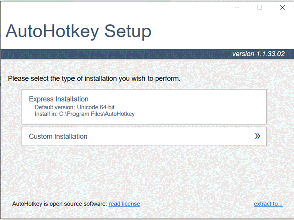
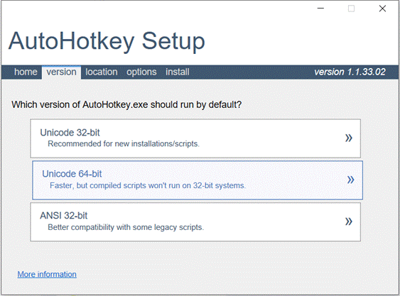
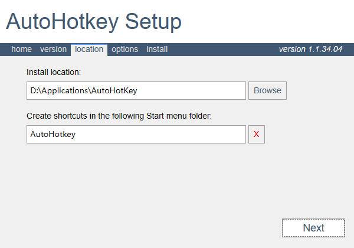
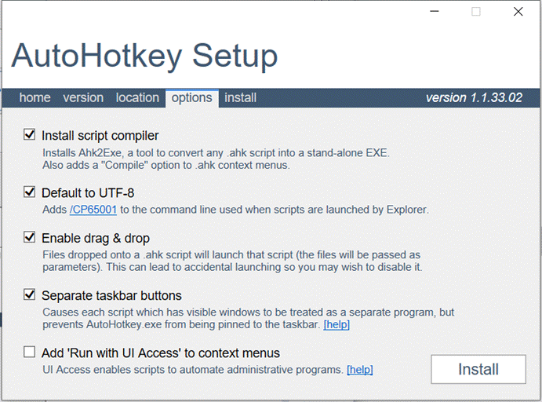
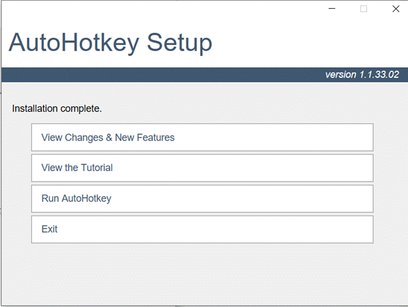

# Potplayer_AHK
利用AutoHotKey实现potplayer 长按倍速播放 松开正常播放

[TOC]


## 1.AHK安装

方法一：官网安装：https://www.autohotkey.com/（能够自由选择版本）

方法二：下载文件安装：[AutoHotkey_1.1.34.04_setup.zip](https://github.com/Jeans-Li/Potplayer_AHK/files/9856692/AutoHotkey_1.1.34.04_setup.zip)

### 	①双击运行安装包

Express Installation是快速安装，可以看到它的一些默认配置，安装位置在C盘，默认版本为Unicode 64-bit。

Custom installation则是自定义安装，通常我们选择自定义安装，可自定义安装位置和安装版本。



### 	②选择默认情况下运行哪个版本的AHK



### 	③自定义安装目录

此处根据个人喜好自定义，建议不要安装在C盘



### 	④选项配置

此处一般选择默认，直接install



### 	⑤安装完毕，Exit



## 2.建立脚本

### 	①新建文本文件，后缀名改为.ahk

### 	②编辑脚本

右键脚本-Edit Script，复制以下代码，保存

```assembly
;Potplayer播放器长按倍速播放
#IfWinActive ahk_class PotPlayer64 ahk_exe PotPlayerMini64.exe
Right::     ; 长按0.3秒方向右键进行倍速播放，松开时恢复
    KeyWait, Right, T0.3
    if ErrorLevel {
        Send, cccccccccccccccccccc  ; 调整此数值修改速度
        ToolTip, >>>
        KeyWait, Right  ; 松开按键恢复正常速度
        Send, z
        ToolTip
    } else Send {Right}
    return
```

### 	③双击运行脚本

## 3.尝试使用

确认脚本处在运行状态：检查右下角任务栏出现脚本任务

打开potplayer-长按倍速播放-松开正常播放
